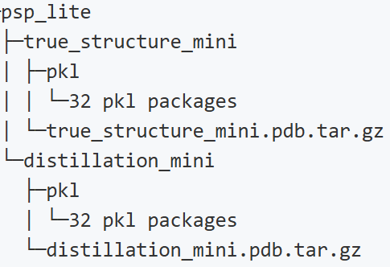

# MEGA Assessment

## 环境配置

本项目基于华为云ModelArts服务进行配置，使用Jupter Notebook进行开发。

1. 首先准备一个Notebook开发环境，初始镜像选择官方提供的`mindspore1.7.0-cuda10.1-py3.7-ubuntu18.04`
2. 选择需要的GPU配置，这边本项目采用的是`GPU: 1*Pnt1(16GB)|CPU: 8核 64GB`
3. 环境配置好之后，新建conda环境，python版本安装3.8，MindSpore和MindSponge可以分别根据下面两个链接教程进行安装[MindSpore](https://www.mindspore.cn/install/),[MindSponge](https://www.mindspore.cn/mindsponge/docs/zh-CN/master/index.html)

选择上述配置的原因是由于MindSponge需要MindSpore 2.0版本以上，MindSpore安装只支持cuda10.1，11.1和11.6，
我们使用多种官方镜像进行配置之后发现使用上述推荐的镜像最为便捷。

## 数据集准备

本项目的训练数据集采用的是[PSP蛋白质结构数据集](http://ftp.cbi.pku.edu.cn/psp/)，数据集大小为1.6TB，解压后为25TB。 MEGA-Assessment训练数据集为PSP数据集中的PSP lite，大约需要500G的空间来存储。数据的存放格式如下所示：



## 训练过程

训练部分的代码MindSponge官方已经将其集成在了PipeLine中，因此，实现训练过程较为便捷。该部分代码如下所示：

````
from mindsponge import PipeLine
from mindsponge.common.utils import get_predict_checkpoint

# 训练相关路径
data_train_path = "../data/train"
model_save_path = "../output/MEGA_Assessment_train.ckpt"
# 推理相关路径
model_predict_path = "../output/MEGA_Assessment.ckpt"
# 模型训练过程
pipe = PipeLine(name="MEGAAssessment")
pipe.set_device_id(0)
pipe.initialize(key="initial_training", model_save_path=model_save_path)
pipe.train(data_train_path, num_epochs=1)
# 模型转换过程
get_predict_checkpoint(model_save_path, 48, model_predict_path)
````

需要注意的是，需要提前下载好数据集放在在指定路径下。同时，由于模型在训练和推理时使用的结构不同，需要将训练得到的权重进行转换才能得到推理用的权重。

## 测试过程

测试部分需要将序列搜索所得pickle文件和推理所得pdb作为输入，进行推理。推理部分需要指定多种参数，代码如下所示：

````
import os
import time
import stat
import pickle
import argparse
import numpy as np
from mindspore import context
from mindsponge import PipeLine
from mindsponge.common.protein import from_pdb_string

parser = argparse.ArgumentParser(description='Inputs for eval.py')
parser.add_argument('--pkl_path', type=str, default="../data/predict/111L_A_1_mini.pkl", help='pkl path')
parser.add_argument('--pdb_path', type=str, default="../data/predict/111L_A_1_renum.pdb", help='pdb_path')
parser.add_argument('--ckpt_path', type=str, default="../output/MEGA_Assessment.ckpt", help='ckpt_path')
parser.add_argument('--device_id', type=int, default=0, help='device id')
parser.add_argument('--device_target', type=str, default="GPU", help='device target')

args = parser.parse_args()
if args.device_target == "Ascend":
    context.set_context(device_target="Ascend", ascend_config={"precision_mode": "must_keep_origin_dtype"})
elif args.device_target == "GPU":
    context.set_context(device_target="GPU")

pipe = PipeLine(name="MEGAAssessment")
pipe.set_device_id(args.device_id)

# from mindsponge.pipeline.pipeline import download_config
# download_config(pipe.config["predict_256"], pipe.config_path + "predict_256.yaml")
# conf = load_config(pipe.config_path + "predict_256.yaml")

pipe.initialize("predict_256")
pipe.model.from_pretrained(args.ckpt_path)

# load raw feature
f = open(args.pkl_path, "rb")
raw_feature = pickle.load(f)
f.close()

# load decoy pdb
with open(args.pdb_path, 'r') as f:
    decoy_prot_pdb = from_pdb_string(f.read())
    f.close()
raw_feature['decoy_aatype'] = decoy_prot_pdb.aatype
raw_feature['decoy_atom_positions'] = decoy_prot_pdb.atom_positions
raw_feature['decoy_atom_mask'] = decoy_prot_pdb.atom_mask

res = protein_assessment.predict(raw_feature)
print("score is:", np.mean(res))
````

我们在`data`文件夹下放了两个示例文件以便测试。
但是由于训练得到的`ckpt`文件过大，我们多次尝试无法通过华为云将其上传到Github之上（大约500Mb），
且无法下载到本地进行上传，因此代码仓库clone到本地之后需要进行重新训练。